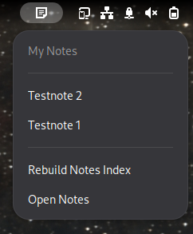
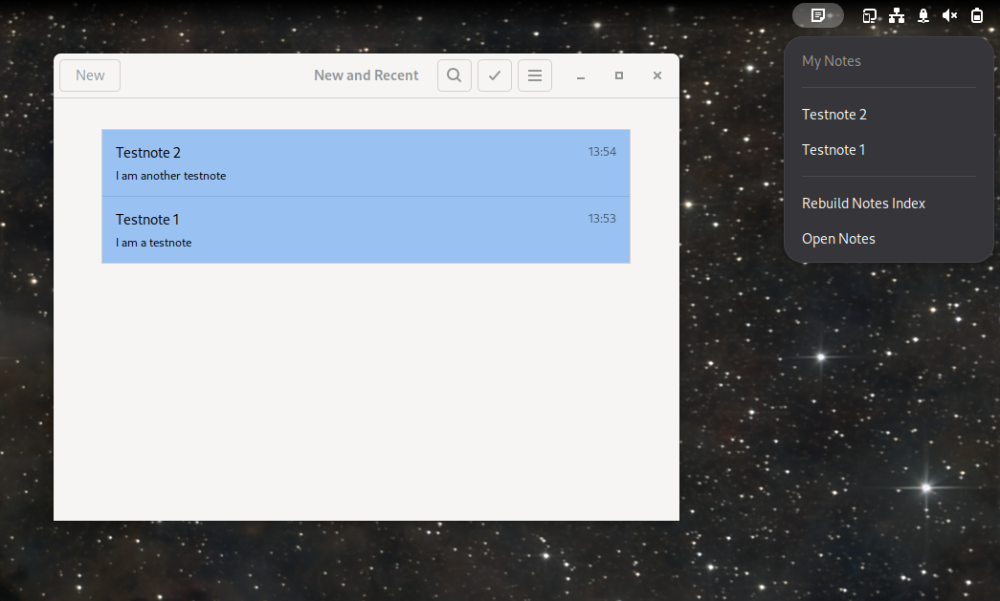

# GNOME Notes Panel

A GNOME Shell extension that provides quick access to GNOME Notes directly from the top panel.

The extension reads the note index maintained by GNOME Notes and displays local notes as well as notes synchronized through Nextcloud in a compact panel menu.

## Features

* Access GNOME Notes from the top panel
* Display local and synchronized Nextcloud notes
* Sort notes by last modification date
* Open individual notes directly in GNOME Notes
* Automatically detect and display note changes
* Rebuild the GNOME Notes index when deleted notes remain visible
* German translation included
* Non-blocking asynchronous database queries
* Modular GJS codebase

## Screenshots

### Notes menu



### Panel and GNOME Notes



## Requirements

* GNOME Shell 48, 49 or 50
* GNOME Notes / Bijiben
* GJS
* TinySPARQL
* `pkill`

On Debian-based distributions, TinySPARQL can usually be installed with:

```bash
sudo apt install tinysparql
```

On Arch Linux and CachyOS, the required Tracker and TinySPARQL components are normally installed as dependencies of GNOME.

Check whether TinySPARQL and GJS are available:

```bash
command -v tinysparql
command -v gjs
```

## Installation

Clone the repository into the local GNOME Shell extensions directory:

```bash
git clone \
    https://github.com/nordcomputer/gnome-notes-panel.git \
    ~/.local/share/gnome-shell/extensions/gnome-notes-panel@nordcomputer
```

Compile the German translation:

```bash
cd ~/.local/share/gnome-shell/extensions/gnome-notes-panel@nordcomputer

mkdir -p locale/de/LC_MESSAGES

msgfmt \
    po/de.po \
    --output-file=locale/de/LC_MESSAGES/gnome-notes-panel@nordcomputer.mo
```

Enable the extension:

```bash
gnome-extensions enable gnome-notes-panel@nordcomputer
```

Depending on the GNOME session, logging out and back in may be required before the extension appears.

Check the extension status:

```bash
gnome-extensions info gnome-notes-panel@nordcomputer
```

## Usage

Click the GNOME Notes icon in the top panel to open the extension menu.

The menu contains the currently indexed notes followed by actions for rebuilding the index and opening GNOME Notes.

### Open a note

Click a note title to open that note in GNOME Notes.

The extension uses the GNOME Notes Shell search provider to activate the selected note. Both local notes and notes synchronized through GNOME Online Accounts are supported.

### Automatic updates

The extension automatically monitors the private Tracker database used by GNOME Notes.

Changes to the following database files are observed:

```text
~/.cache/bijiben/tracker3/meta.db
~/.cache/bijiben/tracker3/meta.db-wal
~/.cache/bijiben/tracker3/meta.db-shm
```

When Tracker reports a possible change, the extension waits briefly and then performs a TinySPARQL query in the background.

Several filesystem events belonging to the same logical update are combined into a single query.

The menu is only redrawn when the actual note list has changed. This avoids visible flickering when Tracker modifies internal database files without changing any notes.

Automatic updates cover changes such as:

* creating a note
* renaming a note
* synchronizing a new Nextcloud note
* changing the contents or modification date of a note
* removing a local note
* changes to the ordering of notes

The previous manual **Refresh Notes** action is therefore no longer required.

### Rebuild Notes Index

**Rebuild Notes Index** performs a more extensive repair of the GNOME Notes index.

Use this action when notes that have already been deleted still appear in the panel despite automatic updates.

This may happen because GNOME Notes can leave obsolete resources in its local Tracker database. The GNOME Notes application and the Nextcloud server may no longer contain the deleted notes while their old Tracker entries remain in the local database.

The rebuild action:

1. closes GNOME Notes
2. stops the GNOME Notes Shell search provider
3. moves the existing Tracker databases into timestamped backup directories
4. removes older backup directories
5. starts GNOME Notes again
6. waits until GNOME Notes has recreated and populated its Tracker index
7. reloads the panel note list
8. reconnects the automatic Tracker monitor

The affected cache directories are:

```text
~/.cache/bijiben/tracker3
~/.cache/bijiben-shell-search-provider/tracker3
```

The actual local note files are not deleted. They remain stored under:

```text
~/.local/share/bijiben
```

Nextcloud notes remain stored on the Nextcloud server.

The rebuild operation only replaces local cache and index data.

GNOME Notes must run while its private index is being recreated. The application therefore opens visibly during the rebuild process and remains open afterward.

The rebuild helper waits for up to approximately 60 seconds for the index to contain notes. If the index remains empty, the operation is reported as failed.

### Automatic update or rebuild?

Automatic updates are sufficient for normal changes.

Use **Rebuild Notes Index** only when the Tracker database itself contains stale or inconsistent entries.

| Situation                             | Expected behavior     |
| ------------------------------------- | --------------------- |
| A new note was created                | Updated automatically |
| A title was changed                   | Updated automatically |
| A new Nextcloud note was synchronized | Updated automatically |
| A local note was removed              | Updated automatically |
| A deleted cloud note still appears    | Rebuild Notes Index   |
| The list remains inconsistent         | Rebuild Notes Index   |

## How it works

GNOME Notes stores indexed note metadata in a private Tracker database.

The extension runs a TinySPARQL query against:

```text
~/.cache/bijiben/tracker3
```

The query returns:

* Tracker resource identifier
* note title
* local path or Nextcloud URL
* data source
* last modification date

Notes are ordered by their last modification date.

Local Trash entries are excluded by filtering URLs containing:

```text
/.Trash/
```

The extension also checks whether local `.note` files still exist before displaying them.

Cloud notes cannot be validated through the local filesystem. When stale cloud resources remain in Tracker, the index rebuild action is required.

### Automatic change detection

The `TrackerMonitor` class watches the Tracker database directory with `Gio.FileMonitor`.

Filesystem events are debounced before querying the database. The resulting note list is converted into a signature containing the relevant note metadata.

The panel menu is updated only when this signature differs from the previous result.

### Opening notes

The `NotesSearchProvider` class communicates with:

```text
org.gnome.Notes.SearchProvider
```

over D-Bus and uses the GNOME Shell `SearchProvider2` interface to open the selected note.

### Rebuilding the index

The `rebuild-index.js` helper is executed as a separate GJS module:

```bash
gjs -m rebuild-index.js
```

It uses `Gio.File` for moving and deleting Tracker directories and `Gio.Subprocess` for stopping GNOME Notes and its search provider.

The helper then starts GNOME Notes and polls the newly created Tracker database through TinySPARQL until at least one note is present.

## Project structure

```text
gnome-notes-panel@nordcomputer/
├── docs/
│   ├── screenshot-menu.png
│   └── screenshot-panel.png
├── lib/
│   ├── notes-service.js
│   ├── search-provider.js
│   └── tracker-monitor.js
├── locale/
│   └── de/
│       └── LC_MESSAGES/
│           └── gnome-notes-panel@nordcomputer.mo
├── po/
│   ├── de.po
│   └── gnome-notes-panel@nordcomputer.pot
├── extension.js
├── metadata.json
├── rebuild-index.js
├── stylesheet.css
├── README.md
├── LICENSE
└── .gitignore
```

### Module responsibilities

#### `extension.js`

Contains:

* GNOME Shell extension lifecycle
* panel button and menu
* note rendering
* status and error messages
* index rebuild workflow

#### `lib/notes-service.js`

Contains:

* TinySPARQL query
* asynchronous query execution
* parsing of query results
* filtering of stale local notes
* note-list signature generation

#### `lib/tracker-monitor.js`

Contains:

* Tracker database monitoring
* filesystem event filtering
* event debouncing
* automatic refresh callbacks

#### `lib/search-provider.js`

Contains:

* D-Bus proxy creation
* GNOME Notes search-provider connection
* activation of selected notes

#### `rebuild-index.js`

Contains:

* stopping GNOME Notes and its search provider
* backing up Tracker databases
* removing old backups
* starting GNOME Notes
* waiting for the new index to be populated

## Translation

The source language is English.

Translatable strings in `extension.js` use the GNOME gettext helper:

```javascript
_('Rebuild Notes Index')
```

Regenerate the POT file after adding or changing translatable strings:

```bash
xgettext \
    --from-code=UTF-8 \
    --language=JavaScript \
    --keyword=_ \
    --package-name='GNOME Notes Panel' \
    --package-version='1.0' \
    --copyright-holder='Mario Maresch' \
    --msgid-bugs-address='notes-extension@nordcomputer.de' \
    --output=po/gnome-notes-panel@nordcomputer.pot \
    extension.js \
    lib/*.js
```

Update the German PO file:

```bash
msgmerge \
    --update \
    --backup=none \
    po/de.po \
    po/gnome-notes-panel@nordcomputer.pot
```

Check the translation:

```bash
msgfmt \
    --check \
    --check-header \
    po/de.po
```

Compile the MO file:

```bash
msgfmt \
    po/de.po \
    --output-file=locale/de/LC_MESSAGES/gnome-notes-panel@nordcomputer.mo
```

The gettext domain in `metadata.json` must match the MO filename:

```json
"gettext-domain": "gnome-notes-panel@nordcomputer"
```

## Development

Reloading GNOME Shell extensions depends on the active display server.

On X11, GNOME Shell can often be restarted with:

```text
Alt+F2
r
Enter
```

On Wayland, log out and back in after changing the extension.

The extension can be disabled and enabled from a terminal:

```bash
gnome-extensions disable gnome-notes-panel@nordcomputer
gnome-extensions enable gnome-notes-panel@nordcomputer
```

View GNOME Shell logs with:

```bash
journalctl --user \
    -f \
    -o cat \
    /usr/bin/gnome-shell
```

A broader user-session log can be viewed with:

```bash
journalctl --user -f
```

The rebuild helper can be tested independently:

```bash
cd ~/.local/share/gnome-shell/extensions/gnome-notes-panel@nordcomputer

gjs -m rebuild-index.js
```

A successful run should end with output similar to:

```text
GNOME Notes Panel: Notes index is ready with 13 note(s)
```

## Compatibility

The currently declared GNOME Shell versions are:

```json
"shell-version": [
    "48",
    "49",
    "50"
]
```

Compatibility declarations indicate versions on which the extension is intended to run. They do not guarantee compatibility without testing.

Additional GNOME Shell versions should only be added after verifying that the extension loads and that the following functions work:

* opening the panel menu
* querying notes through TinySPARQL
* opening local notes
* opening Nextcloud notes
* automatically detecting changes
* rebuilding the note index

## Known limitations

* The extension depends on GNOME Notes' private Tracker database layout.
* GNOME Notes may leave obsolete cloud-note resources in Tracker.
* Deleted cloud notes cannot be reliably detected through the local filesystem.
* Rebuilding the index temporarily restarts and visibly opens GNOME Notes.
* The extension depends on the `tinysparql` command-line utility.
* The rebuild helper depends on `pkill`.
* An empty notes collection cannot currently be distinguished from an index that has not finished rebuilding.
* Only German and English are currently included.
* The implementation is specifically designed for GNOME Notes / Bijiben.

## Safety of the rebuild action

The rebuild helper does not delete the current Tracker database immediately.

It renames the existing database directories using a timestamp:

```text
tracker3.backup-YYYYMMDD-HHMMSS
```

The two newest backups are retained. Older backups are removed automatically.

The rebuild action does not delete:

* local `.note` files
* Nextcloud notes
* GNOME Online Accounts
* Nextcloud credentials
* application settings

## Uninstallation

Disable the extension:

```bash
gnome-extensions disable gnome-notes-panel@nordcomputer
```

Remove the extension directory:

```bash
rm -rf \
    ~/.local/share/gnome-shell/extensions/gnome-notes-panel@nordcomputer
```

Optional Tracker backup directories created by the rebuild helper can be removed separately:

```bash
rm -rf ~/.cache/bijiben/tracker3.backup-*
rm -rf ~/.cache/bijiben-shell-search-provider/tracker3.backup-*
```

Do not remove the active `tracker3` directories unless you intentionally want GNOME Notes to rebuild its indexes.

## License

This project is licensed under the GNU General Public License v3.0 or later.

See the [LICENSE](LICENSE) file for details.

## Author

Mario Maresch
